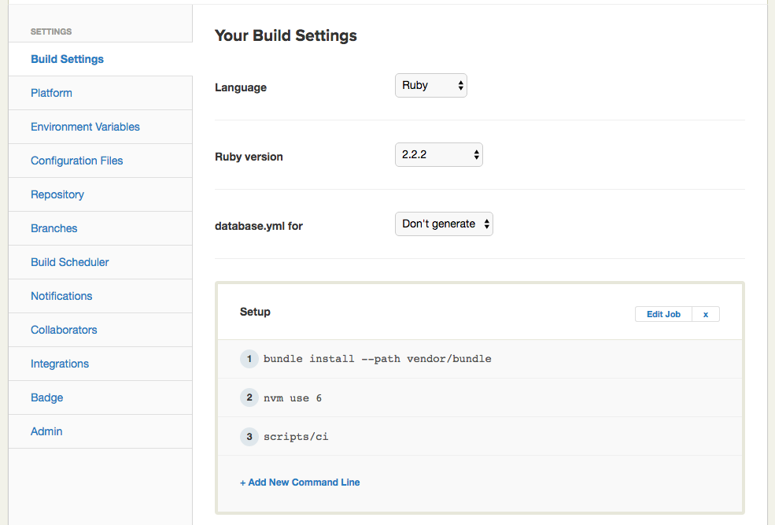
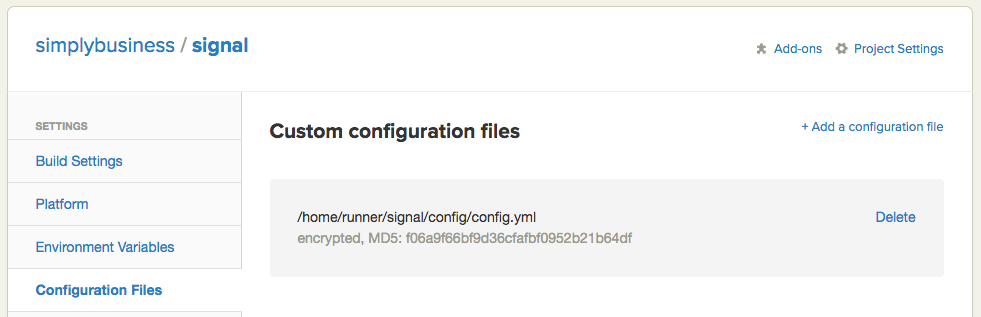

# Signal Simply Business Workshop

## Summary

A tutorial app that demonstrates how to write and setup end to end integration tests against an application that integrates with Twilio. For the full detail, please read [our](http://tech.simplybusiness.co.uk/2016/06/07/continuous-integration-for-twilio/) [blog](http://tech.simplybusiness.co.uk/2016/06/07/continuous-integration-for-twilio-part-2/) [posts](http://tech.simplybusiness.co.uk/2016/06/07/continuous-integration-for-twilio-part-3/).

## Target audience

We assume you are already familiar with the followings

- Basic knowledge about how to use [Twilio.js](https://www.twilio.com/docs/api/client/twilio-js)
- Basic knowledge of Ruby and Sinatra web framework
- Basic knowledge of JavaScript
- Basic knowledge of testing frameworks and tools, such as [RSpec](http://rspec.info/), [Gherkin](https://github.com/cucumber/cucumber/wiki/Gherkin), and [Capybara](https://github.com/jnicklas/capybara)
- Basic knowledge of CI (Continuous Integration), such as [Semaphoreci](http://semaphoreci.com) though the approach is applicable to other solutions.

This project is tested under OS X only.

## Scope of the tests

We use [RUBY QUICKSTART: HELLO MONKEY CLIENT](https://www.twilio.com/docs/quickstart/ruby/client/hello-monkey) as a base project.

This sample project demonstrates the followings

1. Write Capybara tests that assert when a consultant receives a call from a customer
1. Dynamically start [ngrok](http://ngrok.com) and fetch its url
1. Dynamically update a Twilio incoming phone number [callback url](https://www.twilio.com/docs/api/rest/incoming-phone-numbers) to point to the ngrok url
1. Configure Chrome driver to enable running on the headless environment
1. Run the integration tests on Semaphore

## How to setup locally

### Prerequisites

- [Chrome driver](https://github.com/SeleniumHQ/selenium/wiki/ChromeDriver)
- [ngrok](http://ngrok.com)
- Ruby (tested with version 2.2.3)
- [Bundler](http://bundler.io/)
- [Semaphore CI account](https://semaphoreci.com/) which is free for open source. You can also adapt the solution for other CI services.
- [Twilio account](https://www.twilio.com/) of course

For CI servers other than Semaphore, you will need to provision `Xvfb` if this is
not started or installed.

- [Xvfb](https://www.x.org/archive/current/doc/man/man1/Xvfb.1.xhtml)

### Clone the repo

*Substitute your own clone/fork of this repo if desired*

```
git clone https://github.com/simplybusiness/signal
cd signal
bundle
```

### Create a config file

```
cp config/config.yml.example config/config.yml
```

### Obtain Twilio account SID and its auth token

Follow [this Twilio guide](https://support.twilio.com/hc/en-us/articles/223136027-Auth-Tokens-and-how-to-change-them) to obtain Account SID and Auth token, then add them to `config/config.yml` as `account_sid` and `auth_token`

### Purchase a Twilio incoming number

Purchase [Twilio incoming number](https://www.twilio.com/user/account/phone-numbers/incoming
), then add the number to `config/config.yml` as `caller_id` (please omit `+`)

## Running the tests locally

```
bundle exec rake
```

## Running the tests on CI

Create a project in Semaphore CI from your forked/cloned copy of our repo.

At the `Project Setting` section of your project in Semaphore, please do the following

### Add command lines

`nvm use 6` and `scripts/ci` to the `Setup` section.

</img>

Edit `bundle exec rake spec` to `bundle exec rake` in the `Jobs` section.
This ensures `Rubocop` is run as well as the RSpec tests.

#### Starting `Xvfb` if not on Semaphore CI

You may need code like the following in your CI setup code.

*NOTE: This code has not been tested*

```
export DISPLAY=:99.0
/sbin/start-stop-daemon --start --quiet --pidfile /tmp/cucumber_xvfb_99.pid --make-pidfile --background --exec /usr/bin/Xvfb -- :99 -ac -screen 0 1600x1200x16
```

### Upload `config/config.yml`

Make sure you tick 'Encrypt file'

</img>
